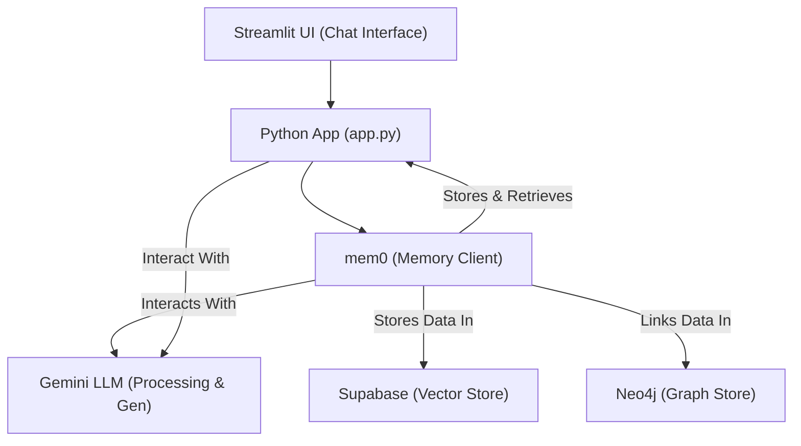

# PLANNING - mem0 Demo Project

**Last Updated:** March 31, 2025

## 1. Project Goal

To create a functional Python demonstration showcasing the `mem0` library's capabilities for AI memory management. This demo will specifically integrate `mem0` with Supabase as a vector store, Neo4j as a graph store, and Google Gemini as the LLM, all presented through a simple chat interface built with Streamlit.

## 2. Scope

**In Scope:**

*   Initialize `mem0` with Supabase, Neo4j, and Gemini configurations.
*   Create a basic Streamlit application with a chat input and message display area.
*   Implement user authentication using Supabase Auth.
*   Process user chat input through `mem0`.
*   Store conversation context/memories using `mem0`'s configured vector (Supabase) and graph (Neo4j) stores.
*   Retrieve relevant context from `mem0` to inform Gemini's responses within the chat flow.
*   Demonstrate basic memory persistence across multiple turns in a single chat session.
*   Utilize environment variables for secure credential management (API Keys, DB URIs).
*   Display 'Prompt token count' and a 'Total token count' in the conversation section in the side panel. These values can be retrieved from  'usage_metadata' object in the 'assistant_response'. These values should be reset when the user clicks on 'Clear Conversation'.
*   **Refactor into a multi-page application:**
    *   Separate 'Chat' functionality into its own page.
    *   Create a 'Memory' page to display all stored memories for the logged-in user.
*   Utilize Streamlit's `st.Page` and `st.navigation` for multi-page structure.

**Out of Scope (Initial Version):**

*   Advanced `mem0` features (e.g., specific memory editing, complex graph queries beyond default behavior).
*   Multi-user support beyond basic authenticated sessions.
*   Production-level error handling and logging beyond Streamlit/mem0 basics.
*   Deployment to a cloud platform.
*   Advanced Streamlit UI features (e.g., user profiles, history browsing).
*   Fine-tuning LLM prompts or behavior beyond basic configuration.
*   Optimizing database performance or indexing strategies beyond defaults.

## 3. Core Functionality

The application will provide a simple chat interface. When a user types a message:

1.  The message is sent to the `mem0` instance.
2.  `mem0` processes the message, potentially using Gemini to extract entities/relationships or summarize.
3.  `mem0` stores relevant information in both Supabase (vector embeddings for semantic search) and Neo4j (graph representation of entities/relationships).
4.  `mem0` searches Supabase and Neo4j for relevant past memories based on the current query and conversation history.
5.  The retrieved memories and the current user message are used to construct a prompt for Gemini.
6.  Gemini generates a response based on the provided context.
7.  The response is displayed back to the user in the Streamlit chat interface.

## 4. Technology Stack

*   **Programming Language:** Python 3.x
*   **Memory Layer:** `mem0` library (`mem0ai`)
*   **LLM:** Google Gemini (via `mem0` integration and directly via `google-generativeai`)
*   **Vector Database:** Supabase (using `pgvector` extension)
*   **Authentication:** Supabase Auth
*   **Graph Database:** Neo4j (AuraDB free tier recommended, or local Docker instance)
*   **Frontend Framework:** Streamlit (with response streaming)
*   **Environment Management:** `venv`
*   **Dependency Management:** `uv`
*   **Dependencies:** `mem0ai[supabase,neo4j,gemini]`, `streamlit`, `python-dotenv`, `supabase`, `google-generativeai`

## 5. Architecture Overview

*   **Multi-page Structure (Phase 8):** The application will be refactored using Streamlit's native multi-page app features (`st.Page`, `st.navigation`).
    *   `app.py`: Will act as the main entry point, primarily setting up navigation.
    *   `pages/1_Chat.py`: Contains the original chat interface logic.
    *   `pages/2_Memory.py`: Contains the logic to fetch and display all memories for the current user.

*   **Streamlit UI:** Captures user input, displays conversation history. Manages session state.
*   **Python App (`app.py`):** Main application logic. Initializes `mem0`, handles Streamlit callbacks, orchestrates calls to `mem0`.
*   **`mem0` Client:** Core memory management library. Configured to use Gemini, Supabase, and Neo4j. Handles memory addition (`add`) and retrieval (`search`/`get`/history).
*   **Gemini LLM:** Used by `mem0` for processing text, extracting information, and generating responses based on context. Requires Google AI API Key.
*   **Supabase:** Stores vector embeddings of memories for semantic search. Requires Supabase Project URL, Anon Key, and Service Role Key. Needs `vector` extension enabled and a suitable table created.
*   **Neo4j:** Stores graph representations of entities and relationships extracted from conversations. Requires Neo4j URI, Username, and Password. Requires APOC plugins if running locally.

## 6. Key Considerations & Risks

*   **API Keys/Credentials:** Securely managing keys for Gemini, Supabase (DB and Auth), and Neo4j is critical. Use environment variables (`.env` file and `python-dotenv`). Ensure Supabase URL and Anon Key (often used for client-side Auth) are available alongside Service Role Key (for server-side DB access).
*   **Database & Auth Setup:** Correctly setting up Supabase (enabling `vector` extension, creating table with correct dimensions, configuring Auth settings like providers/email templates) and Neo4j (instance accessible, credentials correct, APOC plugins if local) is required.
*   **`mem0` Configuration:** Ensuring the `mem0` configuration dictionary correctly points to all services with the right parameters is vital. Referencing `mem0` documentation is key. The `user_id` passed to `mem0` should correspond to the authenticated user.
*   **Dependency Compatibility:** Potential for version conflicts between libraries. Pinning versions might be necessary.
*   **LLM Costs:** Gemini API usage might incur costs. Monitor usage.
*   **`mem0` Understanding:** `mem0` handles much of the complexity, but understanding its basic workflow (add, search, context injection) is needed for effective integration.

## 7. Success Criteria (MVP)

*   The Streamlit application launches without errors.
*   User can type messages into the chat input.
*   Messages and AI responses appear in the chat history.
*   The application successfully initializes `mem0` with Supabase, Neo4j, and Gemini configs.
*   Information mentioned by the user persists and influences subsequent responses within the same session (demonstrating memory retrieval).
*   No explicit errors related to database connections or LLM API calls during a typical chat interaction.
