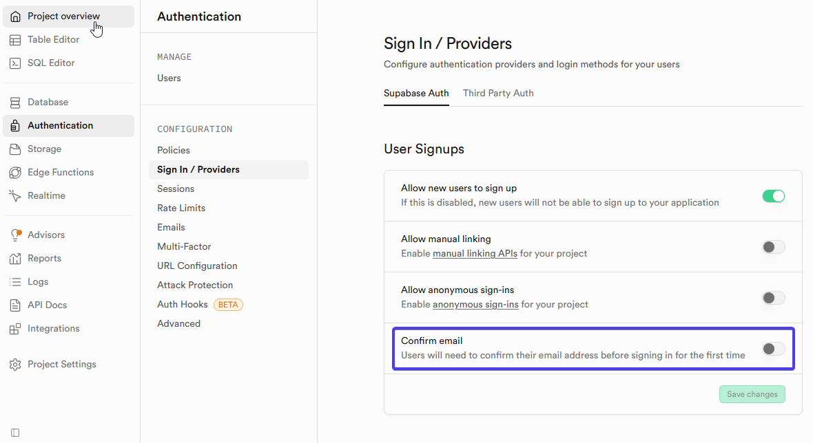
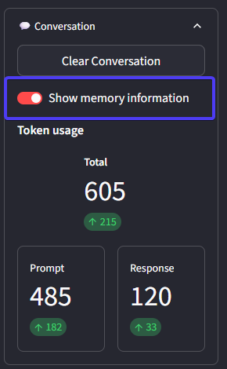
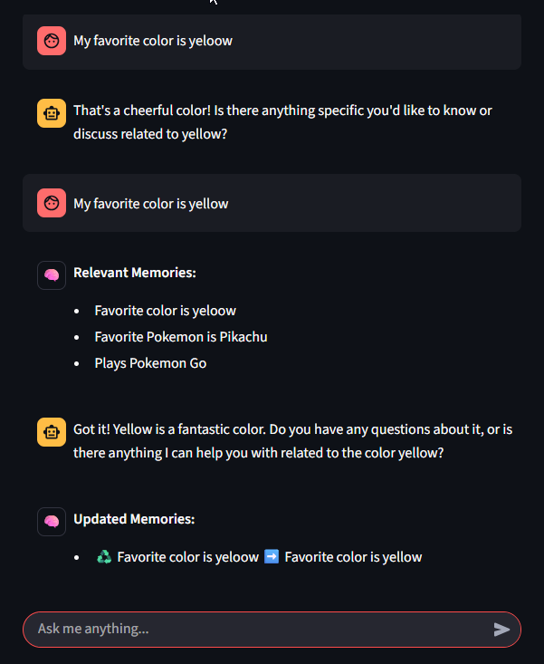
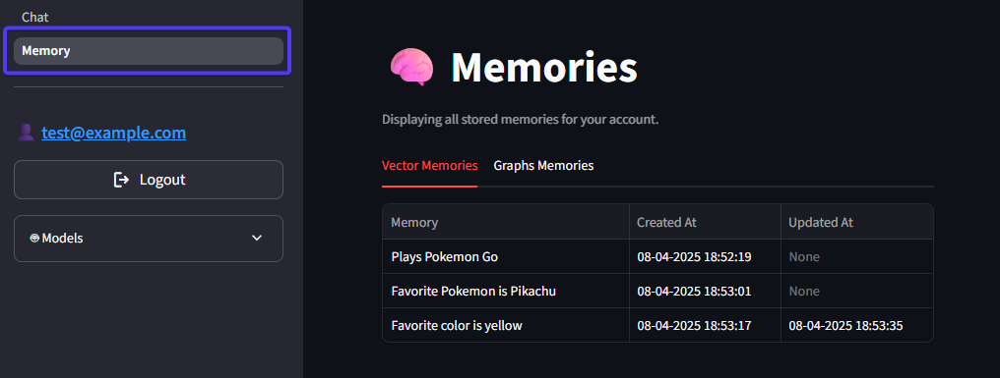
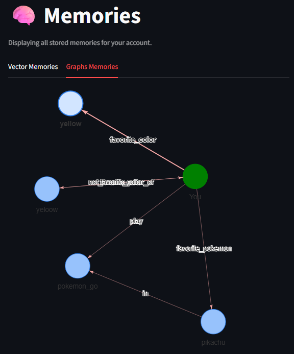
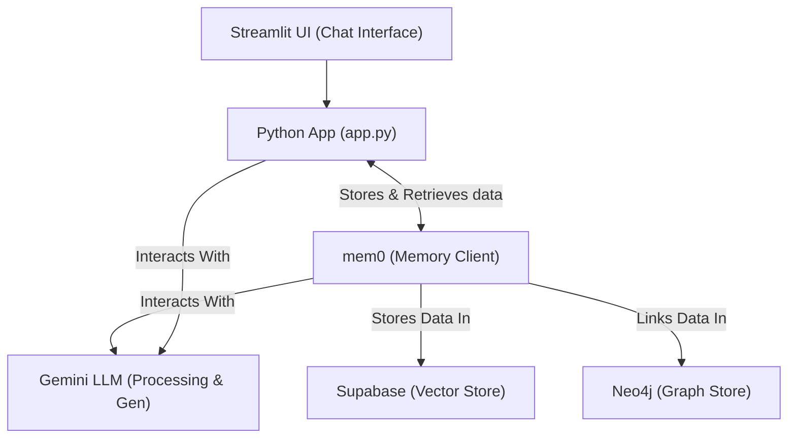

<a id="readme-top"></a>

# mem0 Demo Project - Streamlit Chat

This project demonstrates how to create a learning chatbot using [mem0](https://mem0.ai/) library for AI memory management, integrating it with [Google Gemini](https://aistudio.google.com/), [Supabase](https://supabase.com/) (vector store), and [Neo4j](https://neo4j.com/) (graph store) within a [Streamlit](https://streamlit.io/) chat application.

This is mainly a playground to investigate and learn and should be viewed as such.

## Features

*   ✅ Streaming chat interface powered by [Streamlit](https://streamlit.io/).
*   ✅ Conversation processing and memory management using [mem0](https://mem0.ai/).
*   ✅ LLM integration with [Google Gemini](https://aistudio.google.com/) for chat generation and memory management.
*   ✅ Vector memory storage via [Supabase](https://supabase.com/).
*   ✅ Graph memory storage via [Neo4j](https://neo4j.com/).
*   ✅ Persistence of memories for each user across sessions.
*   ✅ User authentication using [Supabase Auth](https://supabase.com/docs/guides/auth).
*   ✅ Display prompt, Response and Total tokens count for the current prompt and conversation.
*   ✅ Sidebar displaying the LLM model in use and an option to clear the conversation UI.
*   ✅ Display Mem0 memory interactions.
*   ✅ Implement basic Google Gemini moderation.

<p align="right">(<a href="#readme-top">back to top</a>)</p>

## Prerequisites
1.  **`uv` for Python version management and dependency management**

    [`uv`](https://docs.astral.sh/uv/guides/install-python/) is a fast Python package installer and resolver, written in Rust.
    To check if `uv` is already installed, run:
    ```bash
    uv --version
    ```
    If `uv` is not found, you can install it using a [standalone installer](https://docs.astral.sh/uv/getting-started/installation/#standalone-installer) or through your [preferred package manager](https://docs.astral.sh/uv/getting-started/installation/#pypi). Make sure `uv --version` returns a version number before proceeding. For instance:
    ```
    uv --version
    uv 0.8.3 (7e78f54e7 2025-07-24)
    ```

<p align="right">(<a href="#readme-top">back to top</a>)</p>

## Setup Instructions

1.  **Clone the Repository:**
    ```bash
    git clone https://github.com/ytkaczyk/gemini-mem0-streamlit.git
    cd gemini-mem0-streamlit
    ```

2.  **Install Dependencies:**
    *   Install all required packages using `uv sync`:
        ```bash
        uv sync
        ```
    *   *(This installs all necessary libraries including `mem0ai`, `streamlit`, `python-dotenv`, `google-generativeai`, and their dependencies specified in the `uv.lock` file.)*

3.  **Get a Google Gemini API Key:**
    *   Obtain a Google Gemini API key from [Google AI Studio](https://aistudio.google.com/app/apikey).

4.  **Setup Supabase:**
    *   Sign up for a free Supabase account at [https://supabase.com/](https://supabase.com/).
    *   Create a new project.
    *   Navigate to "Project Settings" -> "API" to find your `SUPABASE_URL` and `SUPABASE_ANON_KEY`.
    *   Go to "Database" -> "Connection String" to get your `SUPABASE_CONNECTION_STRING`. Ensure you use the "URI" format.
    *   Enable the `vector` extension in your Supabase database:
        *   Go to "Database" -> "Extensions" and search for "vector".
        *   Toggle it on.
    *   Configure the `Authentication` (optional)
        *   For the purpose of the demo and to simplify account creation setup and allow using any email address (e.g. `test@example.com`), it is convenient to disable email confirmation following account creation.

<p align="center">

</p>

5.  **Setup Neo4j:**
    *   Sign up for a free Neo4j AuraDB account at [https://neo4j.com/cloud/aura/](https://neo4j.com/cloud/aura/).
    *   Create a new Neo4j instance (a free tier is available).
    *   Once your instance is created, download the connection details (usually a `.txt` file). This file will contain your `NEO4J_URI`, `NEO4J_USERNAME`, and `NEO4J_PASSWORD`.

6.  **Configure Environment Variables:**
    *   Copy `.example.env` to `.env` in the project root directory (where `app.py` is located).
    *   Add the credentials from the previous steps to the `.env` file. **Never commit this file to Git.**
        ```dotenv
        # Gemini config
        # Obtain a key at https://aistudio.google.com/app/apikey
        GOOGLE_API_KEY="<your api key>"
        # llm and embedding model
        # Model list at https://ai.google.dev/gemini-api/docs/models
        LLM_MODEL="gemini-2.0-flash"
        # Embedding model list at https://ai.google.dev/gemini-api/docs/models#gemini-embedding and https://ai.google.dev/gemini-api/docs/models#text-embedding
        EMBEDDING_MODEL="models/gemini-embedding-001"
        EMBEDDING_MODEL_DIMS=1536

        # Supabase config
        # Sign up for a free account at https://supabase.com/ or self host
        SUPABASE_URL="https://<supabase project ID>.supabase.co"
        SUPABASE_ANON_KEY="<your anon key>"
        SUPABASE_TABLE_NAME="mem0_memories"
        SUPABASE_CONNECTION_STRING="<database connection string>"

        # Neo4j config
        # Sign up for a free Neo4j AuraDB account at https://neo4j.com/product/auradb/ or self host. 
        NEO4J_URI="neo4j+s://<neo4j aura project ID>.databases.neo4j.io" 
        NEO4J_USERNAME="<usually neo4j>"
        NEO4J_PASSWORD="<your neo4j password>"
        ```
    *   Ensure your Supabase database has the `vector` extension enabled.
    *   Ensure your Neo4j instance is running and accessible.

7.  **Run the Application:**
    *   Execute the following command in your terminal (with the virtual environment activated):
        ```bash
        streamlit run app.py
        ```
    *   The application should open in your default web browser.
    *   Create a user by entering an email address, password and clicking on `Sign Up`. If account creation email confirmation was disabled in Supabase, the account is immediately available and can be used for logging in.

<p align="right">(<a href="#readme-top">back to top</a>)</p>

## AI coding assistance with Cline

Cline AI for VSCode was used to generate the application. Cline AI is an open-source coding agent that can understand entire codebases, plan complex changes, and execute multi-step tasks. In order to provide strong guidance and predictable steps to the coding agent, the application was generated using the following steps:
* Create [`.clinerules`](./.clinerules) file to provide overall rules to Cline. This file is somewhat generic and can be reused across projects. See [documentation](https://docs.cline.bot/features/cline-rules).  The Github Copilot documentation also provides good guidance on creating system-wide, [project](https://docs.github.com/en/copilot/how-tos/configure-custom-instructions/add-repository-instructions) and personal level rules.
* Create the [planning.md](./planning.md) and [task.md](task.md) files. This was done using the [following prompt](./prompts/md-file-generation-prompt.txt):
```
I am planning to create a project with python for demonstrating the mem0 library (https://docs.mem0.ai/overview). I want the demo to use:
- Supabase as a vector database (https://docs.mem0.ai/components/vectordbs/dbs/supabase)
- neo4j as a graph database (https://docs.mem0.ai/open-source/graph_memory/overview)
- gemini as LLM (https://docs.mem0.ai/components/llms/models/gemini)
- Provide a chat based frontend using streamlit (https://streamlit.io/)
You can perform grounded searches to learn more about the technology. 
Then create a PLANNING.md and TASK.md files.

PLANNING.md - high level direction, scope, tech, etc.
TASK.md - initial tasks to knock out for the project
```
* Review and edit the [planning.md](./planning.md) and [task.md](task.md) files.
* Ask Cline to implement the code by following the task sequence in [task.md](task.md).
* Add new features by asking Cline to add tasks to task.md and then implementing them. 

## Points of interest

### Showing memory information

Toggling the `Show Memory Information` under the `Conversation` section is helpful to see which memories are being retrieved and provided as extra context to the LLM prior to answering a prompt as well as how memories are add, deleted or updated. 

<p align="center">

</p>

The following conversation shows how a memory can be updated: 

<p align="center">

</p>

### View user's memory

Navigate to the `Memory` to view the stored memories for the current user, both in the vector and graph data stores. 

   *   Vector memories

<p align="center">

</p>

   *   Graph memories

<p align="center">

</p>


<p align="right">(<a href="#readme-top">back to top</a>)</p>

## How it Works

See [PLANNING.md](planning.md) for more architectural details and [TASK.md](task.md) for development status.

### High level architecture



<p align="right">(<a href="#readme-top">back to top</a>)</p>
